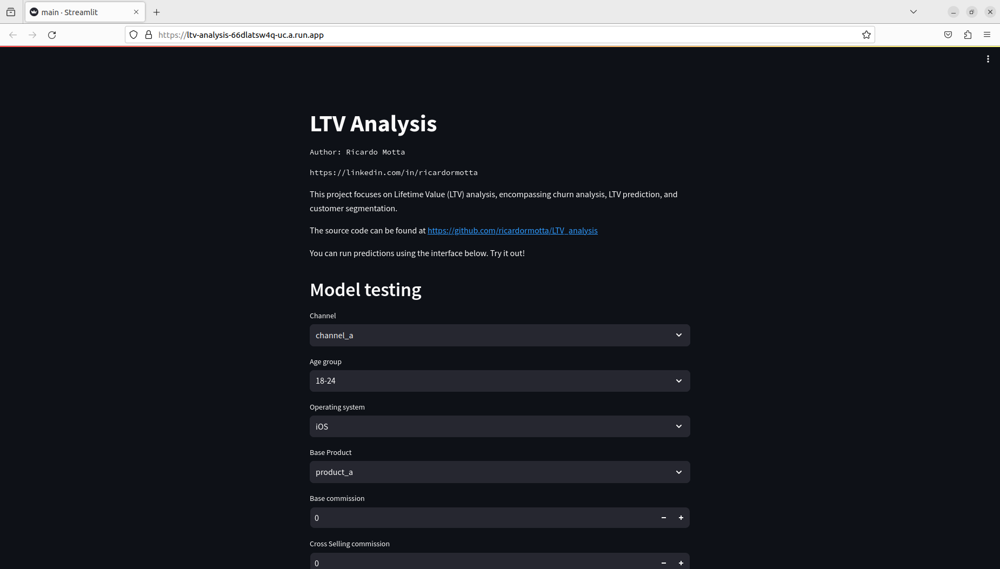

# LTV Analysis 💸

## Project Overview

This project, developed by [Ricardo Raspini Motta](linkedin.com/in/ricardormotta), focuses on Lifetime Value (LTV) analysis, encompassing churn analysis, LTV prediction, and customer segmentation.

The project includes:
- ML Orchestration using Kedro
- CI/CD using Cloud Build in Google Cloud Platform
- A Streamlit App to run predictions interactively


### Project Structure


```
.
├── docs
├── ltv-ml-project
│   ├── conf
│   │   ├── base
│   │   └── local
│   ├── data
│   │   ├── 01_raw
│   │   ├── 02_intermediate
│   │   ├── 03_feature
│   │   ├── 03_primary
│   │   ├── 04_feature
│   │   ├── 04_model_input
│   │   ├── 05_model_input
│   │   ├── 06_models
│   │   ├── 07_model_output
│   │   └── 08_reporting
│   ├── docs
│   │   └── source
│   ├── notebooks
│   └── src
│       ├── ltv_ml_project
│       │   └── pipelines
│       │       ├── compute_metrics
│       │       ├── data_preprocessing
│       │       ├── data_science
│       │       └── feature_engineering
│       └── tests
│           └── pipelines
│               ├── compute_metrics
│               ├── data_preprocessing
│               ├── data_science
│               └── feature_engineering
└── prediction_app
```

## Machine Learning Pipeline

The machine learning pipeline was orchestrated using Kedro. The codebase for the pipeline is housed in the `ltv-ml-project` folder. Below is how the pipeline look like:


To run this visualization, run the command `kedro viz` when inside the folder `ltv-ml-project`. 

## Prediction App

A prediction app has been developed using Streamlit for user-friendly interaction. Access the app [here](https://ltv-analysis-66dlatsw4q-uc.a.run.app/).

A screenshot of the app:



## Exploratory Data Analysis (EDA)

The exploratory data analysis was conducted in Jupyter Notebooks, available in the `ltv-ml-project/notebooks` directory. There are also notebooks using when developing the models.

### Usage

To replicate this project locally, follow these steps:

1. Clone the repository:

```console
git clone https://github.com/your-username/ltv-analysis-project.git
```

2. Set up the environment:

```console 
pip install -r requirements.txt
```

You will also need the tables `base.csv` and `xs` on the following directory:
`/home/ricardormotta/projects/LTV_analysis/ltv-ml-project/data/01_raw`.

3. Navigate to the project directory:

```console 
cd ltv-analysis-project
```

4. Run the ML pipeline.

```console 
kedro run --env=local
```

You can also here visualize the pipeline with:

```console 
kedro viz --env=local
```

4. Set up your cloud environment.

This project runs in the Google Cloud Platform, and the CI/CD files can be seen at the `cloudbuild.yaml` and `dockerfile`. Those are being used to deploy this project.


6.  *Extra*: Explore the notebooks in `ltv-ml-project/notebooks` for detailed analysis.

## Contributors

- Ricardo Raspini Motta ([LinkedIn](linkedin.com/in/ricardormotta))

## License

This project is licensed under the [MIT License](https://opensource.org/license/mit/).